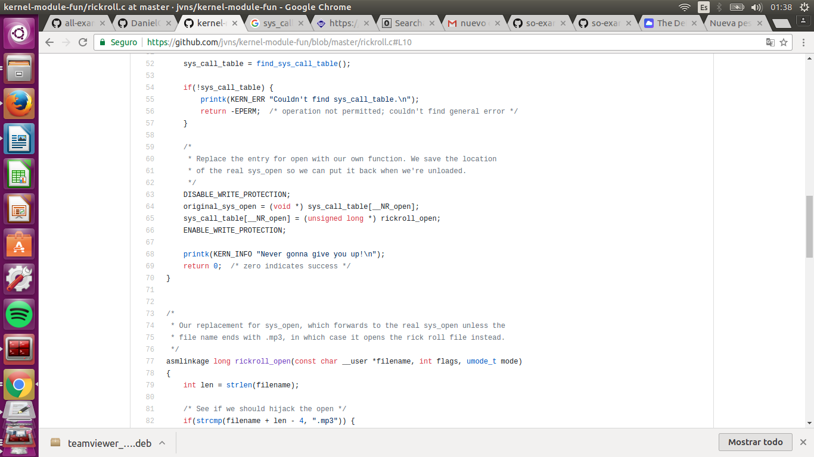
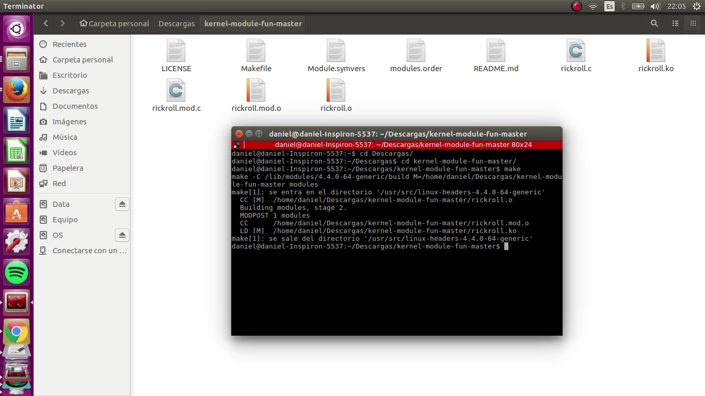

### Examen 1
**Universidad ICESI**  
**Curso:** Sistemas Operativos  
**Docente:** Daniel Barragán C.  
**Tema:** Comandos de Linux, Virtualización  
**Correo:** daniel.barragan at correo.icesi.edu.co

**Estudiante:** Daniel Steven Ocampo
**Código:** A00053980

### Objetivos
* Conocer y emplear comandos de Linux para la realización de tareas administrativas
* Virtualizar un sistema operativo
* Conocer y emplear capacidades de CentOS7 para la vitualización

### Prerrequisitos
* Virtualbox o WMWare
* Máquina virtual con sistema operativo CentOS7

### Descripción
El primer parcial del curso sistemas operativos trata sobre el manejo de los comandos de Linux, virtualización y el uso de las características de CentOS7

### Actividades
3. Resuelva los siguienes retos de la página https://cmdchallenge.com y presente la solución a cada uno de ellos a través de un ejemplo práctico en CentOS7. Presente capturas de pantalla relevantes como evidencias de lo realizado (20%)
  * sum_all_numbers
  * replace_spaces_in_filenames
  * reverse_readme
  * remove_duplicated_lines
  * disp_table

4. Realice un script que cumpla las condiciones que se describen a continuación. Presente capturas de pantalla relevantes como evidencias del funcionamiento (30%)
El usuario gutenberg debe existir en el sistema operativo
El script se debe ejecutar cada 5 minutos, consulte el manual de crontab
EL script debe descargar un libro del proyecto https://www.gutenberg.org/ en el directorio /home/gutenberg/mybooks
Si ya existe un libro en el directorio mybooks, debe ser reemplazado

5. Describa el funcionamiento del código fuente rickroll.c del repositorio de github https://github.com/jvns/kernel-module-fun. Muestre el funcionamiento al compilar el código y cargarlo como un módulo del kernel a través de un video que deberá cargar en Youtube e incluir el enlace en el informe (30%). Se recomienda emplear el sistema operativo Ubuntu con interfaz gráfica para esta prueba.

### Solución: 
3.  

* sum_all_numbers

Este reto consistía en que había un archivo .txt con una lista de números y nos pedían imprimir la suma de esa lista de números para la solución de este reto, ejecute la siguiente línea de código:

```
sum=0; while read line; do ((sum=$sum+$line)); done < sum-me.txt; echo $sum
```
Lo que hace esta línea de código, es crear una variable temporal "sum=0" después se hace un recorrido sobre esta lista leyendo cada línea de esta lista, y en cada iteración suma lo con que lleva en la variable "sum" con lo que hay en la línea ((sum=$sum+$line)) y a lo último imprime el resultado como muestra la siguiente imagen:

 
 
  * replace_spaces_in_filenames
  
  Este reto consiste en una lista de archivos con nombres de personas separadas con un espacio, y nos piden eliminar ese espacio y reemplazarlo por un punto para esto ejecute la siguiente linea de código:
  
```
  ls | sed 's/ /./g'
```

 Lo que hace "|" es que la salida del comando de la izquierda es entrada para el comando de la derecha, y el "sed" lo que hace es reemplazar dependiendo de los parámetros que se le ingresen en los slashs (/)
  

 


 * reverse_readme
 
 Este reto consiste en que hay un archivo.txt con varias líneas y en cada línea hay una frase, y nos piden imprimir cada línea pero recorriendo de manera contraria ósea al revés, esto es que la última línea en este archivo sea la primera en ser impresa y así sucesivamente hasta que la primera línea del archivo sea la última impresa.
 
 Para esto se ejecutó el siguiente comando

```
 tac README
```

El cual como se puede imaginar la palabra "tac" es la forma de decir "cat" pero al revés por lo que el funcionamiento de este comando "tac" es lo mismo que el del cat pero al reves (ósea imprimiendo desde la última línea del archivo hasta la primera) como lo ilustra su nombre.


 * remove_duplicated_lines
 
 Este reto consiste en que en un archivo .txt hay una lista de líneas en donde cada línea es una cadena con una secuencia de caracteres especiales, y muchas de estas líneas se repiten, por lo que nos piden imprimir únicamente una sola línea, y borrando las líneas que se repitan.
 
 Para esto ejecute el siguiente comando:

```
awk '!a[$0]++' faces.txt
```


Lo que hace este poderoso comando ``` awk ``` es algo parecido al comando ``` grep ``` y es buscar la palabra que se le envia por parametro dentro de todo el archivo, y retorna la cantidad de veces que encontró esta palabra, para esto el verifica la cantidad de veces que encontró esta palabra y si la cantidad es mayor a uno, se imprime unicamente esa vez, y de esta manera quitando las lineas duplicadas.


* disp_table

Este reto consiste en un archivo .txt contiene línea separadas con "," (comma-separated) y nos piden acomodarlo de esta manera como lo muestra en la imagen


Para esto ejecutamos el siguientes comando, el cual tabula las columnas y reemplazando la coma por los espacios requeridos 

```
column -s "," -t table.csv
```


4.
Para la solución de este punto, se creó un usuario en el sistema operativo con el nombre "gutenberg" como se muestra en la imagen


Y aquí verificamos como el usuario ya se encuentra en el sistema operativo


Después consultando el manual de crontab, encontré como ejecutar un comando cada cierto periodo de tiempo que uno le determine, para el caso requerido del parcial, se le determinó ejecutarse cada 5 minutos. Ahora por motivos prácticos, no creí necesario crear un archivo .sh (script) ya que este nada más contaba con una sola línea ``` wget -q -O /home/gutenberg/mybooks/996.txt https://www.gutenberg.org/ebooks/996.txt.utf-8 ``` la cual descarga en el directorio especificado en este comando, y además en caso de existir anteriormente se sobrescribirá, por esta razón en el mismo crontab añadí esta línea de código en vez de la ejecución del Script.

Comando:

```
(crontab -l 2>/dev/null; echo "*/5 * * * * wget -q -O /home/gutenberg/mybooks/996.txt https://www.gutenberg.org/ebooks/996.txt.utf-8") | crontab -
```

Prueba de funcionamiento, aquí podemos detallar que en una imagen el libro fue descargado, y a los 5, 10 y 15 minutos después como fue descargado y reemplazado ya que existía anteriormente


Minutos después.....


5. 

El código fuente rickroll.c  (https://github.com/jvns/kernel-module-fun/blob/master/rickroll.c#L10) es un programa hecho en C que al cargarlo como un modulo en el kernel, es capaz de editar las llamadas a las funciones del sistema, en particular la función open, para que cada vez que se abra un archivo con extensión “.mp3” se ejecute la canción “Rick Astley - Never Gonna Give You Up.mp3” en vez de la canción seleccionada por el usuario. A continuación se explica con mas detalle como es posible realizar esto.

Antes de comenzar a explicar su funcionamiento, hay que aclarar que las llamadas al sistema (syscalls), son los mecanismos usados por una aplicación para solicitar un servicio del kernel del sistema operativo. Estos podrían ser servicios relacionados con el hardware (ejemplo, acceder al disco duro), la creación y ejecución de nuevos procesos, el manejo del programador de procesos, etc.

Para poder “engañar” al sistema operativo y modificar las llamadas a las funciones del sistema, el truco se encuentra en modificar la tabla que contiene las llamadas al sistema (sys_call_table), en este arreglo se encuentran los punteros a todos los syscalls, algunos de los mas comunes son open, close, read, write, execve, fork, kill y wait. Este programa particularmente modifica el puntero de la función open que se encuentra almacenado en el arreglo sys_call_table, el cual se reemplaza por el puntero a una nueva función ```“rickroll_open(const char __user *filename, int flags, umode_t mode)”``` que realiza el comportamiento que deseamos, en este caso ejecutar siempre la canción “Rick Astley - Never Gonna Give You Up.mp3” cuando cualquier archivo mp3 es seleccionado.

```int open(const char *pathname, int flags, mode_t mode);```

Open es una función del sistema que es usada para abrir un nuevo archivo y obtener su descriptor.

Para poder modificar la tabla con las llamadas al sistema, primero hay que obtener la referencia en memoria de esta y para esto el programa realiza el siguiente truco (código de la función find_sys_call_table() ): Realiza un recorrido a través del espacio de memoria del kernel y busca la dirección de una de las llamadas al sistema mas conocidas, en este caso sys_close.  Ya que se conoce el offset del puntero de sys_close en la tabla (__NR_close), entonces se puede obtener la dirección base de la tabla sys_call_table.

Luego de esto, podemos modificar cualquier puntero almacenado en la tabla con las llamadas al sistema. En este código se puede apreciar cuando se hace una copia del puntero de la función original de open (con el fin de poder volver a su estado original en un futuro) y luego se modifica el arreglo sys_call_table para que la posición __NR_open contenga el puntero a la función nueva que se ha creado, en este caso rickroll_open.




```asmlinkage long rickroll_open(const char __user *filename, int flags, umode_t mode)```

Esta es la función nueva que reemplaza a la función open en la tabla de funciones del sistema, donde contiene los mismos parámetros que open. Cuando esta función se ejecuta, primero valida si el archivo que se pretende abrir termina en la extensión “.mp3”, si es así entonces ejecuta la función open enviándole como parámetro la ruta donde se encuentra el archivo con la canción “Rick Astley - Never Gonna Give You Up.mp3”, de lo contrario ejecuta la función open enviándole como parámetro la ruta del archivo que se envió como parámetro original en esta función ```rickroll_open```


Compilación del rickroll:



Prueba de funcionamiento del rickroll.c:
https://youtu.be/oAfbTwwPymo


### Referencias ### 

https://youtu.be/oAfbTwwPymo
