### Examen 1
**Universidad ICESI**  
**Curso:** Sistemas Operativos  
**Docente:** Daniel Barragán C.  
**Tema:** Comandos de Linux, Virtualización  
**Correo:** daniel.barragan at correo.icesi.edu.co

**Estudiante:** Daniel Steven Ocampo
**Código:** A00053980

### Objetivos
* Conocer y emplear comandos de Linux para la realización de tareas administrativas
* Virtualizar un sistema operativo
* Conocer y emplear capacidades de CentOS7 para la vitualización

### Prerrequisitos
* Virtualbox o WMWare
* Máquina virtual con sistema operativo CentOS7

### Descripción
El primer parcial del curso sistemas operativos trata sobre el manejo de los comandos de Linux, virtualización y el uso de las características de CentOS7

### Actividades
3. Resuelva los siguienes retos de la página https://cmdchallenge.com y presente la solución a cada uno de ellos a través de un ejemplo práctico en CentOS7. Presente capturas de pantalla relevantes como evidencias de lo realizado (20%)
  * sum_all_numbers
  * replace_spaces_in_filenames
  * reverse_readme
  * remove_duplicated_lines
  * disp_table

4. Realice un script que cumpla las condiciones que se describen a continuación. Presente capturas de pantalla relevantes como evidencias del funcionamiento (30%)
El usuario gutenberg debe existir en el sistema operativo
El script se debe ejecutar cada 5 minutos, consulte el manual de crontab
EL script debe descargar un libro del proyecto https://www.gutenberg.org/ en el directorio /home/gutenberg/mybooks
Si ya existe un libro en el directorio mybooks, debe ser reemplazado

5. Describa el funcionamiento del código fuente rickroll.c del repositorio de github https://github.com/jvns/kernel-module-fun. Muestre el funcionamiento al compilar el código y cargarlo como un módulo del kernel a través de un video que deberá cargar en Youtube e incluir el enlace en el informe (30%). Se recomienda emplear el sistema operativo Ubuntu con interfaz gráfica para esta prueba.

### Solución: 
3.  * sum_all_numbers

Este reto consistia en que habia un archivo .txt con una lista de numeros y nos pedian imprimir la suma de esa lista de numeros para la solución de este reto, ejecute la siguiente linea de código:

```
sum=0; while read line; do ((sum=$sum+$line)); done < sum-me.txt; echo $sum
```
Lo que hace esta linea de codigo, es crear una variable temporal "sum=0" después se hace un recorrido sobre esta lista leyendo cada linea de esta lista, y en cada iteración suma lo con que lleva en la variable "sum" con lo que hay en la linea ((sum=$sum+$line)) y a lo ultimo imprime el resultado como muestra la siguiente imagen:

 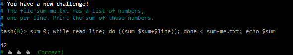
 
  * replace_spaces_in_filenames
  
  Este reto consiste en una lista de archivos con nombres de personas separadas con un espacio, y nos piden eliminar ese espacio y reemplazarlo por un punto para esto ejecute la siguiente linea de código:
  
```
  ls | sed 's/ /./g'
```

 Lo que hace "|" es que la salida del comando de la izquierda es entrada para el comando de la derecha, y el "sed" lo que hace es reemplazar dependiendo de los parametros que se le ingresen en los slashs (/)
  
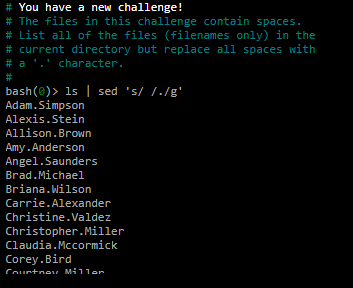
 
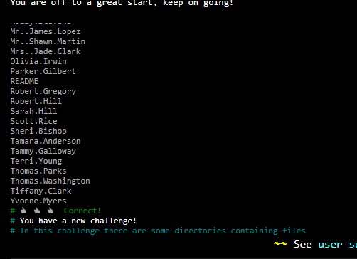


 * reverse_readme
 
 Este reto consiste en que hay un archivo.txt con varias lineas y en cada linea hay una frase, y nos piden imprimir cada linea pero recorriendo de manera contraria osea al reves, esto es que la ultima linea en este archivo sea la primera en ser impresa y así sucesivamente hasta que la primera linea del archivo sea la última impresa.
 
 Para esto se ejecuto el siguiente comando

```
 tac README
```

El cual como se puede imaginar la palabra "tac" es la forma de decir "cat" pero al reves por lo que el funcionamiento de este comando "tac" es lo mismo que el del cat pero al reves (osea imprimiendo desde la ultima linea del archivo hasta la priemra) como lo ilustra su nombre.

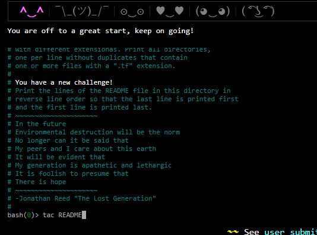

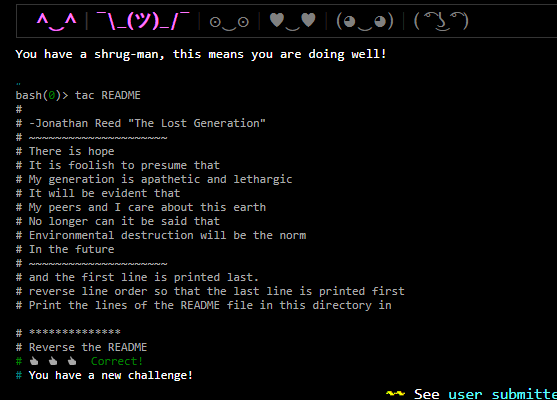


 * remove_duplicated_lines
 
 Este reto consiste en que en un archivo .txt hay una lista de lineas en donde cada linea es una cadena con una secuencia de caracteres especiales, y muchas de estas lineas se repiten, por lo que nos piden imprimir unicamente una sola linea, y borrando las lineas que se repitan.
 
 Para esto ejecute el siguiente comando:

```
awk '!a[$0]++' faces.txt
```

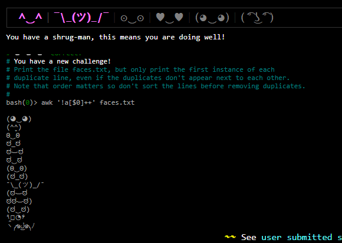

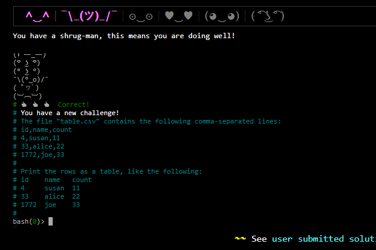


* disp_table

Este reto consiste en un archivo .txt contiene linea separadas con "," (comma-separated) y nos piden acomodarlo de esta manera como lo muestra en la imagen

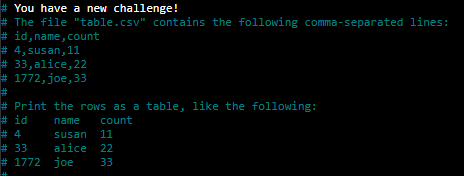

Para esto ejecutamos el siguientes comando, el cual tabula las columnas y reemplazando la coma por los espacios requerimdos 

```
column -s "," -t table.csv
```

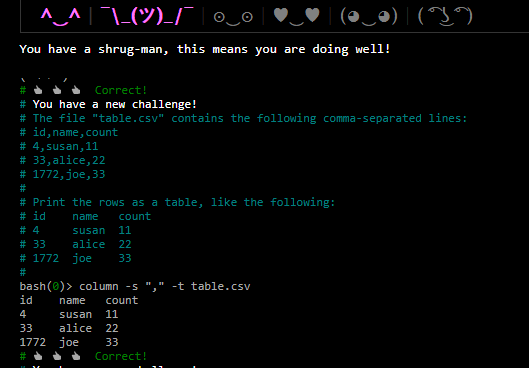


4.
Para la solución de este punto, se creó un usuario en el sistema operativo con el nombre "gutenberg" como se muestra en la imagen

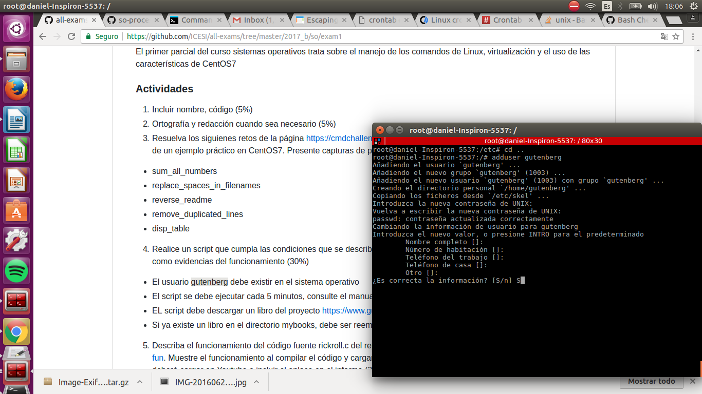

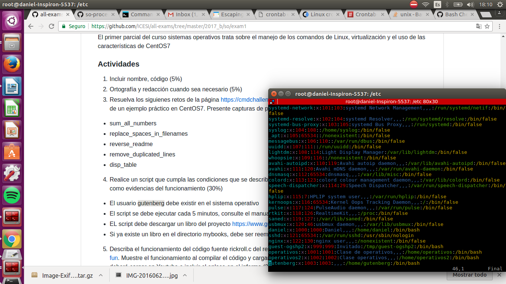

Después consultando el manual de crontab, encontré como ejecutar un comando cada cierto periodo de tiempo que uno le determine, para el caso requerido del parcial, se le determinó ejecutarse cada 5 minutos. Ahora por motivos practicos, no crei necesario crear un archivo .sh (script) ya que este nada mas contaba con una sola linea ``` wget -q -O /home/gutenberg/mybooks/996.txt https://www.gutenberg.org/ebooks/996.txt.utf-8 ``` la cual descarga en el directorio especificado en esta linea, y además en caso de existir anteriormente se sobreescribirá 

```
(crontab -l 2>/dev/null; echo "*/5 * * * * wget -q -O /home/gutenberg/mybooks/996.txt https://www.gutenberg.org/ebooks/996.txt.utf-8") | crontab -
```

Prueba de funcionamiento, aquí podemos detallar que en una imagen el libro fue descargado, y a los minutos después como fue reemplazado

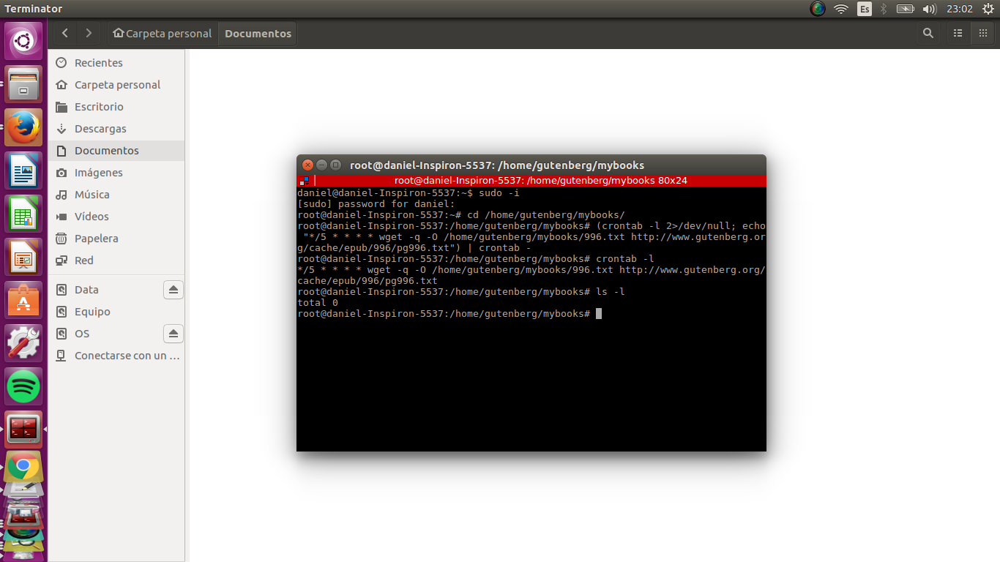


minutos despues.....


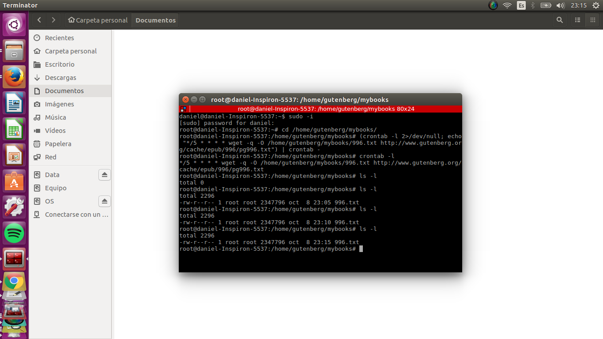


5. 

Prueba de funcionamiento del rickroll.c:
https://youtu.be/oAfbTwwPymo
