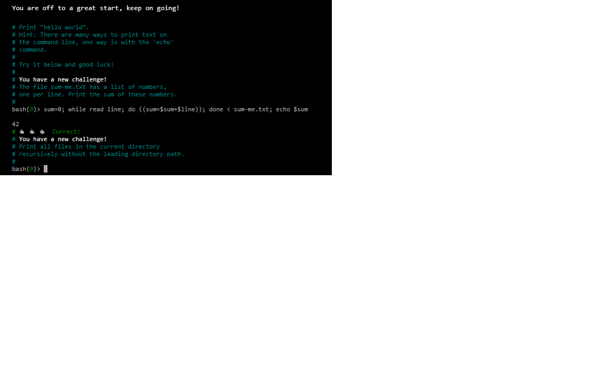

### Examen 1
**Universidad ICESI**  
**Curso:** Sistemas Operativos  
**Docente:** Daniel Barragán C.  
**Tema:** Comandos de Linux, Virtualización  
**Correo:** daniel.barragan at correo.icesi.edu.co

**Estudiante:** Daniel Steven Ocampo
**Código:** A00053980

### Objetivos
* Conocer y emplear comandos de Linux para la realización de tareas administrativas
* Virtualizar un sistema operativo
* Conocer y emplear capacidades de CentOS7 para la vitualización

### Prerrequisitos
* Virtualbox o WMWare
* Máquina virtual con sistema operativo CentOS7

### Descripción
El primer parcial del curso sistemas operativos trata sobre el manejo de los comandos de Linux, virtualización y el uso de las características de CentOS7

### Actividades
3. Resuelva los siguienes retos de la página https://cmdchallenge.com y presente la solución a cada uno de ellos a través de un ejemplo práctico en CentOS7. Presente capturas de pantalla relevantes como evidencias de lo realizado (20%)
  * sum_all_numbers
  * replace_spaces_in_filenames
  * reverse_readme
  * remove_duplicated_lines
  * disp_table

### Solución: 
3.  * sum_all_numbers

Este reto consistia en que habia un archivo .txt con una lista de numeros y nos pedian imprimir la suma de esa lista de numeros para la solución de este reto, ejecute la siguiente linea de código:

```
sum=0; while read line; do ((sum=$sum+$line)); done < sum-me.txt; echo $sum
```
Lo que hace esta linea de codigo, es crear una variable temporal "sum=0" después se hace un recorrido sobre esta lista leyendo cada linea de esta lista, y en cada iteración suma lo con que lleva en la variable "sum" con lo que hay en la linea ((sum=$sum+$line)) y a lo ultimo imprime el resultado como muestra la siguiente imagen:

 
 
  * replace_spaces_in_filenames
  
  Este reto consiste en una lista de archivos con nombres de personas separadas con un espacio, y nos piden eliminar ese espacio y reemplazarlo por un punto para esto ejecute la siguiente linea de código:
  
```
  ls | sed 's/ /./g'
```

 Lo que hace "|" es que la salida del comando de la izquierda es entrada para el comando de la derecha, y el "sed" lo que hace es reemplazar dependiendo de los parametros que se le ingresen en los slashs (/)
  

 

